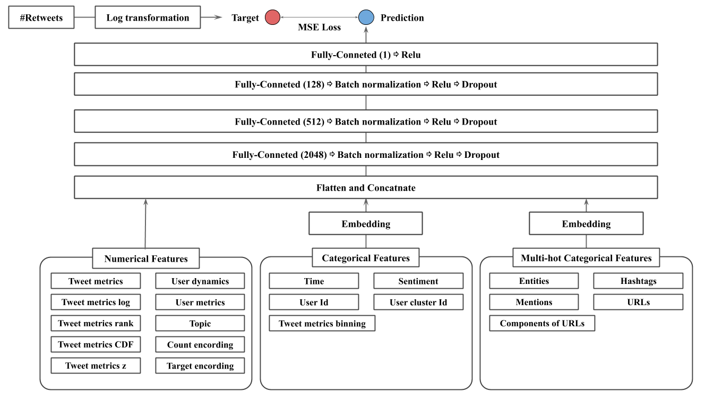

# CIKMAnalytiCup-2020 COVID-19 Retweet Prediction Challenge

## overview



## usage

### download data (TweetsCOV19)

- register codelab and join "COVID-19 Retweet Prediction Challenge"
  - https://competitions.codalab.org/competitions/25276
- download data (https://competitions.codalab.org/competitions/25276#participate-get_starting_kit)

### run

```
$ cd ./run
$ sh solution.sh
```

## results

- 3rd palce / 200+ participants
- Final leaderboard of the top six teams (semi-finalists)
  - competition page: https://competitions.codalab.org/competitions/25276#results

| Rank |  Team               |  MLSE      |
| ---- | ----                | ----       |
|  1   |  vinayaka           |  0.120551  |
|  2   |  mc-aida            |  0.121094  |
|  3   |  myaunraitau (ours) |  0.136239  |
|  4   |  parklize           |  0.149997  |
|  5   |  JimmyChang         |  0.156876  |
|  6   |  Thomary            |  0.169047  |


## folder structure

```
CIKMAnalytiCup-2020

├── exp # deploy the experiment's config
     └── (experiment name)
             └── config.py

├── features # save extracted feature files
     └── (feature_name).feather

├── folds # save cross validation data table files
     └── (folds_name).csv

├── input
     └── public_dat
         └── feature.name
         └── train.data
         └── validation.data
         └── test.data

├── run
     └── solution.sh
     └── ensemble.py

├── save
     └── model/
     └── model_predict/
     └── predict/

├── src
     └── create_folds.py
     └── dataset.py
     └── feature_extraction.py
     └── model.py
     └── train_5fold.py
     └── utils.py
     └── utils_feature.py
     └── utils_model.py

├── submission # save submission files
     └── (submission_name).zip
```